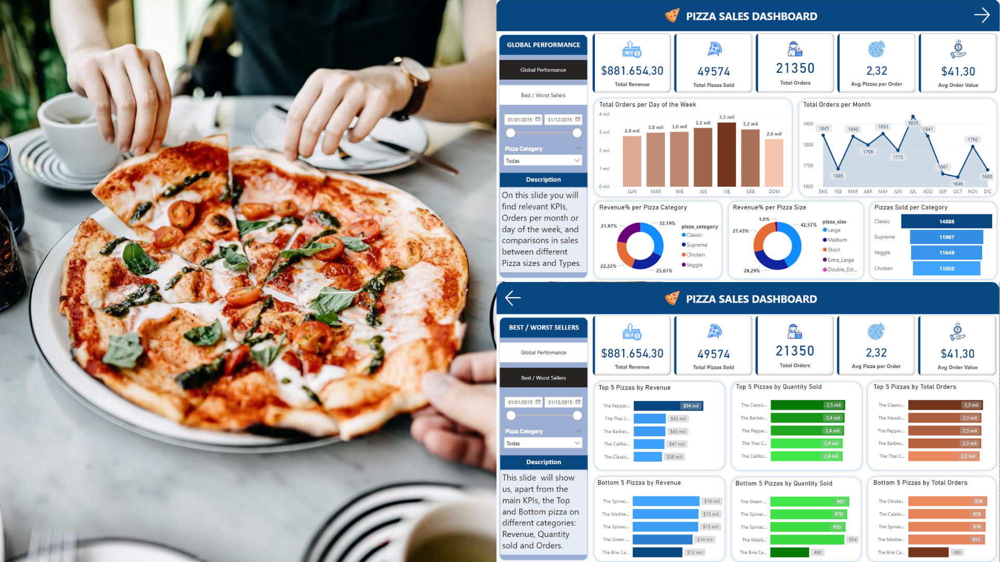

# Pizza Sales Analysis in SQL and Power BI

### A Data Analytics Projects with SQL and PowerBI to control any online Business

Who doesn't like pizza? All of us eat pizza sometimes... there are thousand types of them: Peperoni, Margeritta, XXL, Barbaque,... Lots of different options to choose.

That's why I decided to do this project on a online business, analysing their performance and trying to solve some Business Questions that may occur. It is important to understand that this project is applicalbe for any B2C online business, the pizza is just an example to give some specific KPIs.

For this project, these are the following steps:

## Steps of the project

* Question Formulation
* Data Acquisition
* Data Analysis
* Reporting

What I'll be doing in this project is taking data from pizza_sales.csv to analyze and then report the analysis results. For a more realistic process, I've created a server in wich the data will be sotred and process, as most of the times csv file aren't the most efficient way to work with (specially with big amounts of data). So, for this project, it'd be better that you create a server with a database insight to run them. The ttols I used during the project are just two:

- Miscrosoft SQL Server Management Studio
- Power BI Desktop

Without further ado, let's begin with the main points:

### Question Formulation

This time, Question Formulation become one of the most important steps. In data projects, we always start with a question or a need. But this time, as we are representing the global business need, there will be many of them. All the questions that need to be solved are stored id the pdf file [Pizza Sales Questions and Business Needs](business_questions/Pizza%20Sales%20Questions%20and%20Business%20Needs.pdf). I strongly encourage yout to watch the main questions, because they represent the typicall questions a business like this would have.

### Data Acquisition

In order to reflect real life projects, I created a Server with a database in wich I store the Data from the csv file. Here attached you can find some images on the server and database creation, and the csv import.

In the report step, I'll connect directly the database, not the csv file.

With this step done, we can advance to Data Analysis.

### Data Analysis

This step solves every one of the business questions. I've split every question in different Queries, so you can inspect every query with its answer.

### Reporting

The aim of this step is to show all the information found in SQL, but in a way that non technical profiles could understand the business performance. It needs to be complete, concise and easy to understand, and at the same time you need to get the big picture of business development and main KPIs with just a quick look.

As mentioned before, I've connected this report directly with the data from the server, as ifwe had a bigger project in terms of data.

You can see the results on the [Pizza_dashboard](report/Pizza_dashboard.pbix) file. This will download the pbix file containing the report.

Anyway, I attach the two main slides as an image:

As you'll see, the relevant information is pretty easy to detect, and we can extract many important insights just having a check. 

## Project file Structure

- `data/`: Contains the original Data
- `sql_queries/`: Contains the SQL queries used to do Data Analytics.
- `business_questions/`: Contains the pdf file with the questions solved suring the project.
- `images/`: Images used in the project in any way.
- `report/`: Contains the pbix file with the final report from our analysis.

I hope you enjoy this project! If you have any doubt, you know you can always contact me!